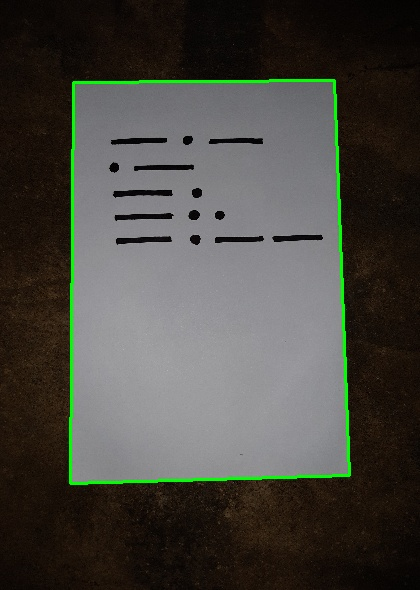
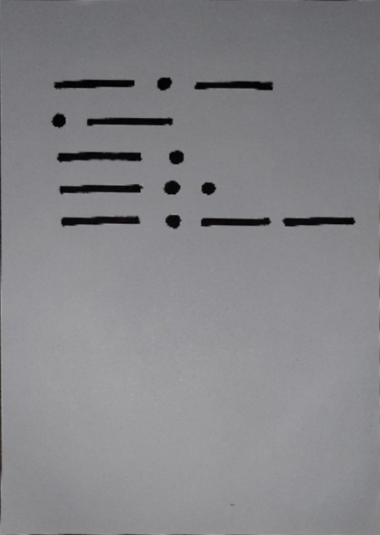
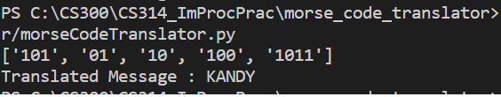

# Morse Code Translator

## Overview
Morse code is a method encode characters in a text as sequences of two different signal durations, called dots and dashes. Morse code was invented by Samuel F. B. Morse in the 1830s then advanced in the 1840s. This is a simple script which can easily convert images of morse code into plain text.

## Getting Started

### Prerequisites
Install 
[Python3](https://www.python.org/downloads/)
[opencv V3.0+](https://pypi.org/project/opencv-python/)
[NumPy V1.0+](https://pypi.org/project/numpy/)

### Installation

### Usage
First clone this project
```sh
git clone https://github.com/ravdsn/morse-code-translator.git
cd morse-code-translator 
```
Then, run morseCodeTranslator.py 
```sh
python3 morseCodeTranslator.py 
```

## Screenshots

#### 1. Input image


#### 2. Crop paper part that contain morse codes
 


#### 3. Output



## :warning: Warning 
Gives some error with opencv V4.0+
